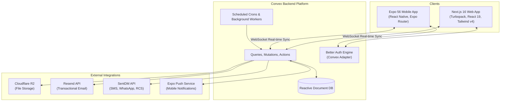
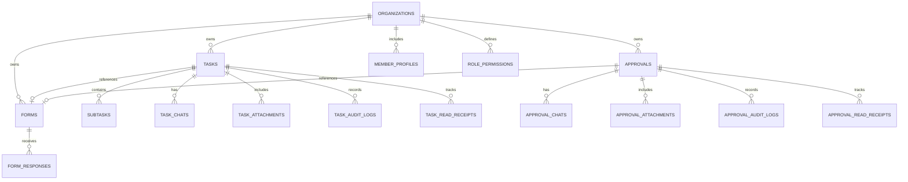
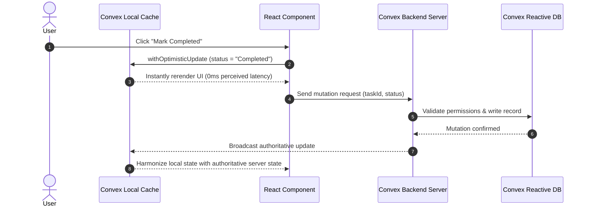
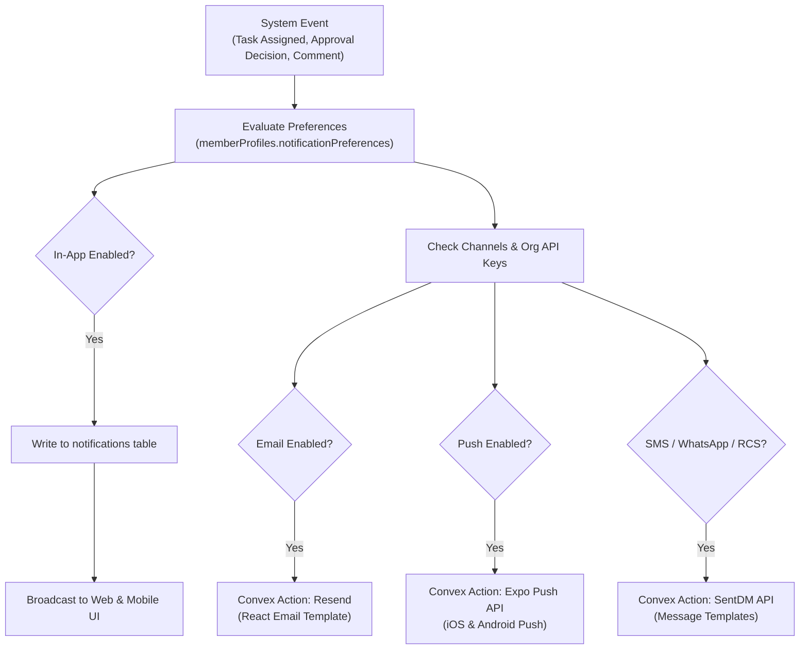

# Ground Control Architecture

This document provides a comprehensive overview of the architecture, data models, real-time mechanisms, and subsystems powering **Ground Control**.

---

## 1. System Topology

Ground Control is architected as a modular monorepo providing real-time synchronization between web clients, native mobile clients, and a reactive backend.



---

## 2. Core Subsystems

### 2.1 Web Application (`apps/web`)
- **Framework**: Next.js 16 with App Router, Turbopack bundling, and React 19.
- **Routing**: Grouped route architecture:
  - `(app)`: Protected dashboard, tasks, approvals, chats, forms, settings, and profile views.
  - `(auth)`: Sign-in, sign-up, email verification, onboarding, and invitation acceptance flows.
  - `(landing)`: Marketing homepage.
  - `(legal)`: Terms of service, privacy policy, and data deletion pages.
  - `shared-forms/[formId]`: Public-facing form submission portal.
- **State & Data**: Real-time subscriptions via Convex React (`useQuery`, `useMutation`, `useAction`). Local client state managed with Zustand.
- **UI Architecture**: Shared design tokens via `@workspace/ui` (shadcn/ui + Radix UI + Tailwind CSS v4).

### 2.2 Mobile Application (`apps/mobile`)
- **Framework**: Expo SDK 56 with Expo Router for file-based navigation.
- **Styling**: Uniwind (Tailwind CSS engine tailored for React Native).
- **Authentication**: `@better-auth/expo` paired with `expo-secure-store` for biometric and secure token storage.
- **Notifications**: `expo-notifications` integration handling background and foreground push payloads.

### 2.3 Backend Engine (`packages/backend`)
- **Platform**: Convex Serverless Reactive Database.
- **Reactivity**: All queries maintain active WebSocket connections. When data mutations occur, subscribed clients automatically receive updated diffs.
- **Scheduled Tasks**: Convex crons (`convex/crons.ts` and `convex/taskCron.ts`) evaluate periodic events such as overdue task checks and scheduled reminder dispatch.

---

## 3. Data Model Architecture

The data schema (`packages/backend/convex/schema.ts`) is designed around real-time collaboration, auditability, and multi-tenancy:



### Key Tables & Responsibilities

1. **`tasks`**:
   - Stores title, description, priority (`Urgent`, `High`, `Medium`, `Low`), status, due dates, assignee IDs, collaborator IDs, subscriber IDs, and recurrence definitions.
   - Supports `completedRequiresApproval` flag that bridges tasks into approval workflows.

2. **`approvals`**:
   - Represents structured approval requests with statuses (`Pending`, `Approved`, `Declined`, `Rework`).
   - Links to optional `taskId`, `formId`, and `formResponseId`.

3. **`forms` & `formResponses`**:
   - `forms`: Field definitions (types: `text`, `textarea`, `radio`, `checkbox`, `select`, `date`, `number`, `file`, `image`), validation rules, and standalone availability.
   - `formResponses`: Key-value submission payload linked to submitters and optional tasks or approvals.

4. **`taskChats` & `approvalChats`**:
   - Real-time messaging attached to entities.
   - Supports markdown content, edit/deletion tracking (`isEdited`, `isDeleted`), system events (`isSystem`, `statusChange`), and attachment references.

5. **`notifications`**:
   - Multi-tenant notification queue storing entity links, delivery channels (`email`, `push`, `sms`, `rcs`, `whatsapp`), read states, and actor metadata.

6. **`memberProfiles`**:
   - Enriches Better Auth user records with organization-specific positions, departments, phone numbers, integration toggles, and notification preferences.

---

## 4. Real-Time Sync & Optimistic UI Strategy

Convex provides automatic cache invalidation and query re-computation. To eliminate perceived latency, all user-initiated state mutations employ **Optimistic UI Updates**:



---

## 5. Notification Dispatch Pipeline

Ground Control features an omnichannel notification engine that evaluates user preferences and organization credentials before routing messages:



---

## 6. Monorepo Dependency Flow

To maintain modularity and avoid cyclic dependencies, code flows from utilities up to applications:

```
[packages/typescript-config] ──┐
[packages/eslint-config]     ──┼─► [packages/ui] ─────────► [apps/web]
                               │                               ▲
                               └─► [packages/backend] ─────────┴─► [apps/mobile]
```

- **`packages/ui`**: Pure presentation primitives; contains no backend dependencies.
- **`packages/backend`**: Exposes typed Convex client APIs (`api.*`) consumed by both `apps/web` and `apps/mobile`.
- **`apps/web` & `apps/mobile`**: Consumers that assemble UI components and subscribe to backend queries.
