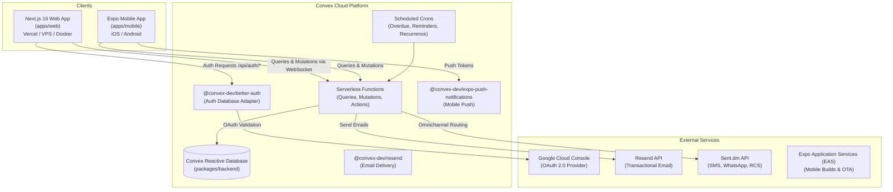

# Ground Control Production Deployment Guide

This guide provides end-to-end, production-ready instructions for deploying all components of the **Ground Control** platform: the **Convex backend**, the **Next.js web application**, the **Expo mobile application**, and integrated third-party services (**Better Auth**, **Google OAuth**, **Resend**, and **Sent.dm**).

---

## 1. System Architecture & Topology



---

## 2. Prerequisites & Accounts

Before deploying to production, ensure you have:

| Service / Tool | Purpose | Requirements |
|---|---|---|
| **Node.js & pnpm** | Monorepo build and package management | Node.js `>= 20.0.0`, pnpm `>= 10.0.0` |
| **Convex Account** | Production database and serverless functions | [Convex Dashboard](https://dashboard.convex.dev/) account |
| **Web Hosting Provider** | Next.js frontend hosting | [Vercel](https://vercel.com/) (recommended), or Docker VPS / Netlify |
| **Google Cloud Console** | Google OAuth authentication | GCP project with OAuth 2.0 Client credentials |
| **Resend Account** | Transactional email delivery | [Resend](https://resend.com/) account with a verified domain |
| **Sent.dm Account** *(Optional)* | Omnichannel SMS, WhatsApp, RCS notifications | [Sent.dm](https://sentdm.com/) account with 9 approved templates |
| **Expo Account** *(Optional)* | Native mobile application builds | [Expo](https://expo.dev/) account for EAS builds |

---

## 3. Step 1: Deploy the Convex Backend

The Convex backend (`packages/backend`) contains your database schema, indexes, serverless functions, authentication hooks, cron jobs, and notification dispatchers.

### 3.1. Log in to Convex

From the workspace root, authenticate your machine with the Convex CLI:

```bash
npx convex login
```

### 3.2. Deploy to Production

Run the backend deploy script from the root of the repository:

```bash
pnpm deploy:backend
```

*(This executes `pnpm --filter @workspace/backend exec convex deploy`)*.

> [!NOTE]
> If this is your first time deploying to production, Convex will prompt you to link the repository to a new or existing Convex project. Once linked, it generates two critical URLs:
> - **Production Convex URL**: `https://<deployment-name>.convex.cloud`
> - **Production Convex Site URL**: `https://<deployment-name>.convex.site`

Save both URLs; they are required when configuring the Next.js frontend and mobile app.

### 3.3. Configure Convex Backend Environment Variables

Go to your **[Convex Dashboard](https://dashboard.convex.dev/) > Select Project > Settings > Environment Variables** and configure the following:

| Variable Name | Required | Description | Example |
|---|:---:|---|---|
| `SITE_URL` | **Yes** | Canonical URL of your deployed Next.js web application | `https://tasks.yourdomain.com` |
| `BETTER_AUTH_SECRET` | **Yes** | 32-byte secure random string (generate with `openssl rand -hex 32`) | `a28d0907aab261bd057ca...` |
| `GOOGLE_CLIENT_ID` | **Yes** | Google OAuth 2.0 Web Client ID | `468244006...apps.googleusercontent.com` |
| `GOOGLE_CLIENT_SECRET` | **Yes** | Google OAuth 2.0 Web Client Secret | `GOCSPX-Nx_VIfOSY...` |
| `EMAIL_FROM` | **Yes** | Sender email address (must match verified domain in Resend) | `Ground Control <tasks@yourdomain.com>` |
| `RESEND_API_KEY` | **Yes** | Resend API key for sending invitations and notifications | `re_XVtTfAR5_EYB...` |
| `SENT_DM_API_KEY` | *Optional* | Sent.dm API key for SMS / WhatsApp / RCS notifications | `snt_live_...` |
| `SENTDM_TASK_ASSIGNED_TEMPLATE_ID` | *Optional* | Sent.dm Template ID for task assignment | `task_assigned` |
| `SENTDM_TASK_STATUS_CHANGED_TEMPLATE_ID` | *Optional* | Sent.dm Template ID for status change | `task_status_changed` |
| `SENTDM_TASK_DUE_SOON_TEMPLATE_ID` | *Optional* | Sent.dm Template ID for 24h due reminder | `task_due_soon` |
| `SENTDM_TASK_OVERDUE_TEMPLATE_ID` | *Optional* | Sent.dm Template ID for overdue alert | `task_overdue` |
| `SENTDM_TASK_COMMENT_TEMPLATE_ID` | *Optional* | Sent.dm Template ID for task discussion | `task_comment` |
| `SENTDM_APPROVAL_REQUESTED_TEMPLATE_ID` | *Optional* | Sent.dm Template ID for new approval requests | `approval_requested` |
| `SENTDM_APPROVAL_STATUS_CHANGED_TEMPLATE_ID` | *Optional* | Sent.dm Template ID for approval decisions | `approval_status_changed` |
| `SENTDM_APPROVAL_COMMENT_TEMPLATE_ID` | *Optional* | Sent.dm Template ID for approval discussion | `approval_comment` |
| `SENTDM_FORM_RESPONSE_SUBMITTED_TEMPLATE_ID` | *Optional* | Sent.dm Template ID for form responses | `form_response_submitted` |

> [!TIP]
> If your organizations configure their own custom Resend or Sent.dm API keys inside the application settings, Convex will automatically use the organization-level keys first and fall back to the platform environment variables above.
> For the complete template bodies and variables for Sent.dm, see [SENTDM_TEMPLATES.md](file:///Users/shoaibkn/Documents/Projects/ground-control/SENTDM_TEMPLATES.md).

### 3.4. (Optional) CI/CD Deployments with Convex

To automate backend deployments via GitHub Actions or GitLab CI:
1. In your Convex Dashboard, go to **Settings > Deploy Keys**.
2. Generate a new Deploy Key.
3. Add `CONVEX_DEPLOY_KEY` as a secret in your CI/CD repository settings.
4. Add the deployment step to your CI pipeline:
   ```yaml
   - name: Deploy Convex Backend
     run: pnpm --filter @workspace/backend exec convex deploy
     env:
       CONVEX_DEPLOY_KEY: ${{ secrets.CONVEX_DEPLOY_KEY }}
   ```

---

## 4. Step 2: Configure External Integrations

### 4.1. Google OAuth Setup

1. Open the **[Google Cloud Console](https://console.cloud.google.com/)**.
2. Navigate to **APIs & Services > Credentials**.
3. Create an **OAuth 2.0 Client ID** with Application Type set to **Web application**.
4. Configure **Authorized JavaScript origins**:
   ```
   https://tasks.yourdomain.com
   ```
5. Configure **Authorized redirect URIs**:
   ```
   https://tasks.yourdomain.com/api/auth/callback/google
   https://<deployment-name>.convex.site/api/auth/callback/google
   ```
6. Copy the **Client ID** and **Client Secret** and add them to both Convex and Next.js environment configurations.

### 4.2. Resend Setup

1. Log in to **[Resend](https://resend.com/)**.
2. Navigate to **Domains > Add Domain** (e.g. `yourdomain.com` or `mail.yourdomain.com`).
3. Add the DNS records (`SPF`, `DKIM`, `MX`) provided by Resend to your domain registrar.
4. Once verified, create an API key under **API Keys**.
5. Set `RESEND_API_KEY` and `EMAIL_FROM` in your Convex environment variables.

---

## 5. Step 3: Deploy the Next.js Web Application (`apps/web`)

The Next.js application hosts the frontend UI and the Better Auth route handler (`/api/auth/*`).

### Required Web Environment Variables

Configure these variables on your web hosting platform:

```env
# Convex Production URLs
NEXT_PUBLIC_CONVEX_URL=https://<deployment-name>.convex.cloud
NEXT_PUBLIC_CONVEX_SITE_URL=https://<deployment-name>.convex.site

# Canonical Application URL
NEXT_PUBLIC_SITE_URL=https://tasks.yourdomain.com

# Better Auth Configuration (Must match backend BETTER_AUTH_SECRET)
BETTER_AUTH_SECRET=a28d0907aab261bd057ca...
BETTER_AUTH_URL=https://tasks.yourdomain.com

# Google OAuth Credentials (Matching backend)
GOOGLE_CLIENT_ID=468244006...apps.googleusercontent.com
GOOGLE_CLIENT_SECRET=GOCSPX-Nx_VIfOSY...
```

---

### Option A: Deploy on Vercel (Recommended)

Vercel natively integrates with Turborepo and Next.js.

1. **Import Git Repository**:
   - Go to [vercel.com/new](https://vercel.com/new) and select the `ground-control` repository.
2. **Project Settings**:
   - **Framework Preset**: `Next.js`
   - **Root Directory**: Select `apps/web` (or leave as `./` with monorepo root)
   - If Root Directory is `./`:
     - **Build Command**: `pnpm build:web`
     - **Output Directory**: `apps/web/.next`
     - **Install Command**: `pnpm install`
   - If Root Directory is `apps/web`:
     - Vercel automatically detects Turborepo and configures the build cache.
3. **Environment Variables**:
   - Add all 7 variables listed in the [Required Web Environment Variables](#required-web-environment-variables) section.
4. **Deploy**:
   - Click **Deploy**. Vercel will build `@workspace/ui`, bundle Next.js, and output the production deployment.
5. **Assign Custom Domain**:
   - Go to **Project Settings > Domains**.
   - Add your production domain (e.g. `tasks.yourdomain.com`) and update your DNS records (CNAME `cname.vercel-dns.com`).

---

### Option B: Deploy with Docker (Self-Hosted / VPS / Cloud Run / Coolify)

For self-hosting, use the multi-stage Docker build optimized for Turborepo and Next.js standalone output.

#### 1. Enable Standalone Output in `apps/web/next.config.mjs`

Verify or update `apps/web/next.config.mjs`:

```javascript
/** @type {import('next').NextConfig} */
const nextConfig = {
  output: "standalone",
  transpilePackages: ["@workspace/ui"],
  turbopack: {
    root: "../../",
  },
}

export default nextConfig
```

#### 2. Root Dockerfile (`Dockerfile`)

Create a `Dockerfile` at the root of the repository:

```dockerfile
FROM node:20-alpine AS base
RUN corepack enable && corepack prepare pnpm@10.28.0 --activate

FROM base AS builder
RUN apk update && apk add --no-cache libc6-compat
WORKDIR /app
COPY . .
RUN pnpm install --frozen-lockfile
RUN pnpm build:web

FROM base AS runner
WORKDIR /app
ENV NODE_ENV=production
ENV PORT=3000

RUN addgroup --system --gid 1001 nodejs
RUN adduser --system --uid 1001 nextjs

COPY --from=builder /app/apps/web/public ./apps/web/public
COPY --from=builder --chown=nextjs:nodejs /app/apps/web/.next/standalone ./
COPY --from=builder --chown=nextjs:nodejs /app/apps/web/.next/static ./apps/web/.next/static

USER nextjs
EXPOSE 3000

CMD ["node", "apps/web/server.js"]
```

#### 3. Docker Compose with Nginx Reverse Proxy (`docker-compose.yml`)

```yaml
version: "3.8"

services:
  web:
    build:
      context: .
      dockerfile: Dockerfile
    restart: always
    environment:
      - PORT=3000
      - NEXT_PUBLIC_CONVEX_URL=https://<deployment-name>.convex.cloud
      - NEXT_PUBLIC_CONVEX_SITE_URL=https://<deployment-name>.convex.site
      - NEXT_PUBLIC_SITE_URL=https://tasks.yourdomain.com
      - BETTER_AUTH_SECRET=your_32_byte_secret
      - BETTER_AUTH_URL=https://tasks.yourdomain.com
      - GOOGLE_CLIENT_ID=your_client_id
      - GOOGLE_CLIENT_SECRET=your_client_secret
    ports:
      - "3000:3000"
```

---

### Option C: Deploy on Ubuntu / Debian VPS with PM2 & Nginx

#### 1. Server Prerequisites

```bash
# Update system and install Node.js 20 & pnpm
curl -fsSL https://deb.nodesource.com/setup_20.x | sudo -E bash -
sudo apt-get install -y nodejs nginx git
sudo corepack enable && sudo corepack prepare pnpm@10.28.0 --activate
sudo npm install -g pm2
```

#### 2. Clone and Build

```bash
cd /var/www
git clone https://github.com/your-org/ground-control.git
cd ground-control

# Install dependencies
pnpm install --frozen-lockfile

# Create production environment file in apps/web/.env.production.local
cat << 'EOF' > apps/web/.env.production.local
NEXT_PUBLIC_CONVEX_URL=https://<deployment-name>.convex.cloud
NEXT_PUBLIC_CONVEX_SITE_URL=https://<deployment-name>.convex.site
NEXT_PUBLIC_SITE_URL=https://tasks.yourdomain.com
BETTER_AUTH_SECRET=your_32_byte_secret
BETTER_AUTH_URL=https://tasks.yourdomain.com
GOOGLE_CLIENT_ID=your_client_id
GOOGLE_CLIENT_SECRET=your_client_secret
EOF

# Build web application
pnpm build:web
```

#### 3. Run with PM2

```bash
pm2 start "pnpm start:web" --name "ground-control-web"
pm2 save
pm2 startup
```

#### 4. Configure Nginx Reverse Proxy

Create `/etc/nginx/sites-available/ground-control`:

```nginx
server {
    server_name tasks.yourdomain.com;

    location / {
        proxy_pass http://127.0.0.1:3000;
        proxy_http_version 1.1;
        proxy_set_header Upgrade $http_upgrade;
        proxy_set_header Connection 'upgrade';
        proxy_set_header Host $host;
        proxy_cache_bypass $http_upgrade;
        proxy_set_header X-Forwarded-For $proxy_add_x_forwarded_for;
        proxy_set_header X-Forwarded-Proto $scheme;
    }
}
```

Enable site and configure SSL using Let's Encrypt Certbot:

```bash
sudo ln -s /etc/nginx/sites-available/ground-control /etc/nginx/sites-enabled/
sudo nginx -t && sudo systemctl reload nginx
sudo apt-get install -y certbot python3-certbot-nginx
sudo certbot --nginx -d tasks.yourdomain.com
```

---

## 6. Step 4: Deploy the Mobile Application (`apps/mobile`)

The mobile application is built using **Expo SDK 56** and **React Native**.

### 6.1. Configure Mobile Environment

Configure `apps/mobile/.env` or EAS Secrets:

```env
EXPO_PUBLIC_CONVEX_URL=https://<deployment-name>.convex.cloud
EXPO_PUBLIC_CONVEX_SITE_URL=https://<deployment-name>.convex.site
```

### 6.2. Install EAS CLI and Authenticate

```bash
pnpm dlx eas-cli login
```

### 6.3. Initialize EAS Configuration

If `apps/mobile/eas.json` does not exist, initialize it:

```json
{
  "cli": {
    "version": ">= 12.0.0"
  },
  "build": {
    "development": {
      "developmentClient": true,
      "distribution": "internal"
    },
    "preview": {
      "distribution": "internal"
    },
    "production": {
      "autoIncrement": true,
      "env": {
        "EXPO_PUBLIC_CONVEX_URL": "https://<deployment-name>.convex.cloud",
        "EXPO_PUBLIC_CONVEX_SITE_URL": "https://<deployment-name>.convex.site"
      }
    }
  },
  "submit": {
    "production": {}
  }
}
```

### 6.4. Build for App Store & Google Play

From the workspace root or `apps/mobile`:

```bash
# Build Android App Bundle (AAB) for Google Play
pnpm --filter mobile exec eas build --platform android --profile production

# Build iOS Archive (IPA) for Apple App Store / TestFlight
pnpm --filter mobile exec eas build --platform ios --profile production

# Or build both concurrently
pnpm --filter mobile exec eas build --platform all --profile production
```

Submit directly to app stores via:
```bash
pnpm --filter mobile exec eas submit --platform all
```

---

## 7. Step 5: Background Jobs & Cron Monitoring

Ground Control executes automated background jobs defined in [`packages/backend/convex/crons.ts`](file:///Users/shoaibkn/Documents/Projects/ground-control/packages/backend/convex/crons.ts):

| Cron Job Name | Schedule | Target Function | Purpose |
|---|---|---|---|
| `Check overdue tasks` | Every 1 hour | `internal.taskCron.checkOverdueTasks` | Scans for past-due tasks and fires in-app, email, and Sent.dm alerts |
| `Check due soon tasks` | Every 4 hours | `internal.taskCron.checkDueSoonTasks` | Scans for tasks due in `< 24 hours` and dispatches reminders |
| `Process recurring tasks` | Every 1 hour | `internal.taskCron.processRecurringTasks` | Spawns next task iterations for daily, weekly, monthly, and yearly recurrences |

### Monitoring Crons
1. Open the [Convex Dashboard](https://dashboard.convex.dev/).
2. Select your production project and click the **Crons** tab.
3. Verify that all 3 crons show status `Scheduled` and view execution history and timestamps.

---

## 8. Post-Deployment Verification & Smoke Tests

Execute these verification checks immediately following deployment:

- [ ] **Homepage & Public Routes**: Visit `https://tasks.yourdomain.com` and verify the landing / login page loads without console errors.
- [ ] **Email Sign-Up & Login**: Register a new user with email and password. Confirm verification email arrives via Resend.
- [ ] **Google OAuth**: Test sign-in with Google. Verify redirection to Google consent screen and back to the dashboard.
- [ ] **Convex Reactive Sync**: Open two browser windows side by side. Create a task in Window A and verify Window B updates instantly without page refresh.
- [ ] **File / Attachment Storage**: Upload an attachment in a task discussion to verify Convex / Cloudflare R2 file storage.
- [ ] **Forms Engine**: Navigate to `/shared-forms/[formId]` in an incognito window. Submit a test response and ensure the owner is notified.
- [ ] **Sent.dm Notifications**: (If configured) Update a task status and verify delivery via SMS / WhatsApp / RCS.
- [ ] **Mobile Client Connectivity**: Open the mobile build and verify successful login and real-time task sync with the production backend.

---

## 9. Troubleshooting & FAQ

### 1. `Invalid redirect_uri` on Google Sign-In
- **Cause**: The redirect URL configured in Google Cloud Console does not match your domain.
- **Fix**: Add both `https://<your-domain>/api/auth/callback/google` and `https://<convex-site-url>/api/auth/callback/google` to Google Console's Authorized redirect URIs.

### 2. Authentication Fails or Sessions Drop Immediately
- **Cause**: `BETTER_AUTH_SECRET` in Convex backend environment variables does not match `BETTER_AUTH_SECRET` in Next.js web environment variables.
- **Fix**: Generate one 32-byte secret (`openssl rand -hex 32`) and paste the exact same value in both Convex and Vercel/VPS settings.

### 3. Emails Fail with `403 Forbidden` from Resend
- **Cause**: `EMAIL_FROM` domain has not been verified in Resend, or `RESEND_API_KEY` is missing/restricted.
- **Fix**: Ensure the sender domain in `EMAIL_FROM` (e.g. `tasks@yourdomain.com`) matches a domain with verified `SPF` and `DKIM` records in Resend.

### 4. Client Components Cannot Connect to Convex
- **Cause**: Client-side environment variables `NEXT_PUBLIC_CONVEX_URL` or `NEXT_PUBLIC_CONVEX_SITE_URL` are missing or were changed without a rebuild.
- **Fix**: Next.js bakes `NEXT_PUBLIC_*` variables into client bundles at build time. After changing these variables in your hosting dashboard, trigger a **clean redeploy / rebuild**.

---

## 10. Summary Checklist

```
[ ] Step 1: npx convex login && pnpm deploy:backend
[ ] Step 2: Configure Convex Environment Variables in Convex Dashboard
[ ] Step 3: Configure Google OAuth credentials & redirect URIs
[ ] Step 4: Verify Resend domain & get API key
[ ] Step 5: (Optional) Set up Sent.dm 9 message templates & API key
[ ] Step 6: Deploy Next.js web app (Vercel / Docker / VPS) with production env vars
[ ] Step 7: (Optional) Build & submit mobile app via EAS
[ ] Step 8: Run post-deployment smoke tests & verify Convex Crons tab
```
