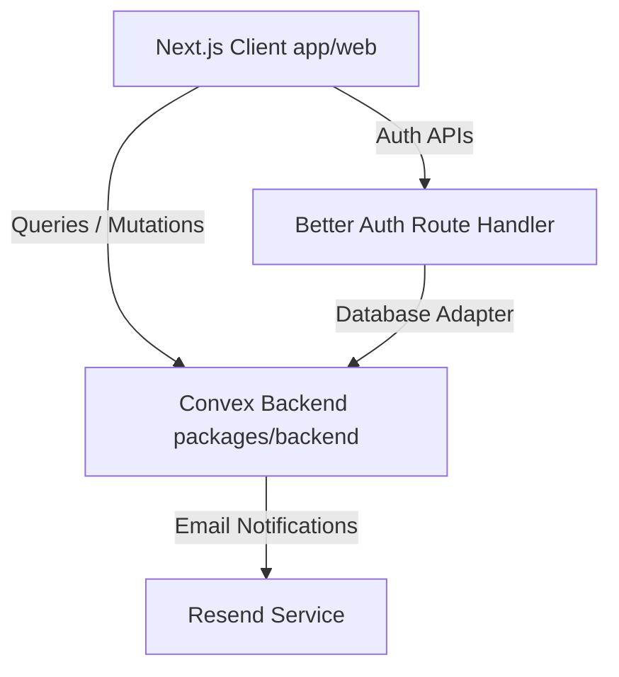

# Ground Control Production Deployment Guide

This guide describes step-by-step instructions for preparing, building, and deploying the **Ground Control** web application and its **Convex** backend in production.

---

## Architecture Overview



Ground Control relies on:
1. **Next.js (`apps/web`)** for frontend rendering, state synchronization, and the Better Auth API server handler.
2. **Convex (`packages/backend`)** for reactive document database, serverless backend functions, and indexing/crons.
3. **Resend** for transactional emails (e.g. sign-in, password reset, invitations).
4. **Google Cloud Console** (or other OAuth providers) for user single sign-on.

---

## Step 1: Convex Backend Production Setup

Convex functions and schemas need to be deployed to a production deployment. 

1. **Sign in to Convex**:
   If you aren't signed in, log in to your Convex dashboard using the CLI:
   ```bash
   npx convex login
   ```
 2. **Configure/Deploy to your Production Project**:
   Run the deploy command from the workspace root or inside the `packages/backend` directory:
   ```bash
   pnpm deploy:backend
   ```
   *Note: Because `convex deploy` is designed specifically for production deployments, it automatically targets your production environment without prompting you to choose between development and production. If this is your first time deploying, the CLI will guide you to associate it with an existing project or create a new one.*

3. **Configure Convex Environment Variables**:
   Go to your Convex Dashboard under **Settings > Environment Variables** and configure the following variables:
   
   | Variable Name | Description | Example |
   |---|---|---|
   | `SITE_URL` | Canonical URL of your deployed Next.js web application. | `https://ground-control.yourdomain.com` |
   | `BETTER_AUTH_SECRET` | A secure random 32-byte secret. (Generate using `openssl rand -hex 32` or similar). | `a4f89d6e...` |
   | `GOOGLE_CLIENT_ID` | Production Google OAuth application client ID. | `123456789-abc.apps.googleusercontent.com` |
   | `GOOGLE_CLIENT_SECRET` | Production Google OAuth application client secret. | `GOCSPX-XXXX` |
   | `EMAIL_FROM` | The email address from which transactional emails are sent. | `Ground Control <onboarding@yourdomain.com>` |
   | `RESEND_API_KEY` | (Optional) Your Resend API key for emailing. | `re_123456...` |

---

## Step 2: Next.js Frontend Production Setup

You can host your Next.js application on platforms like **Vercel**, **Netlify**, **Render**, or self-host it on a **VPS** (e.g. using PM2 or Docker).

### Configuration Options

Configure the following environment variables in your hosting provider's dashboard:

| Variable Name | Description | Source / Reference |
|---|---|---|
| `NEXT_PUBLIC_CONVEX_URL` | The URL of the production Convex deployment. | Found in Convex dashboard settings. |
| `NEXT_PUBLIC_CONVEX_SITE_URL` | The HTTPS URL ending in `.convex.site` for HTTP actions. | Found in Convex dashboard settings. |
| `NEXT_PUBLIC_SITE_URL` | The canonical URL of your Next.js frontend. | e.g. `https://ground-control.yourdomain.com` |
| `BETTER_AUTH_SECRET` | Same secret used in Convex backend configuration. | A secure random 32-byte key. |
| `BETTER_AUTH_URL` | The root URL for Better Auth APIs. | Matches `NEXT_PUBLIC_SITE_URL` exactly. |
| `GOOGLE_CLIENT_ID` | Production Google OAuth client ID. | Matches Convex setting. |
| `GOOGLE_CLIENT_SECRET` | Production Google OAuth client secret. | Matches Convex setting. |

---

## Step 3: OAuth Provider (Google) Configuration

To support Google authentication in production:

1. Go to the **Google Cloud Console > Credentials**.
2. Create or configure your OAuth 2.0 Client ID.
3. Set the **Authorized Javascript Origins**:
   - `https://ground-control.yourdomain.com` (Your production site URL)
4. Set the **Authorized redirect URIs**:
   - `https://ground-control.yourdomain.com/api/auth/callback/google`
   - `https://your-production-subdomain.convex.site/api/auth/callback/google` (if authenticating directly with Convex HTTP actions)

---

## Step 4: Build and Verify

To build your application and test locally before deploying:

1. **Build the entire workspace**:
   Runs Next.js production builds and bundles dependencies:
   ```bash
   pnpm build:web
   ```
2. **Start the Production server**:
   Starts the built Next.js server locally in production mode on port `3000`:
   ```bash
   pnpm start:web
   ```

---

## Step 5: Production Maintenance

### Monitoring Crons
Convex production crons (such as task due date checking and recurring task processing) will run automatically based on the schedule configured in [crons.ts](file:///Users/shoaibkn/Documents/Projects/ground-control/packages/backend/convex/crons.ts). You can monitor execution logs, status, and history in the **Crons** tab of your Convex dashboard.

### Database Updates & Schema Changes
Any schema additions or indexes defined in `schema.ts` are automatically uploaded and applied with zero downtime when you run:
```bash
pnpm deploy:backend
```
If you introduce breaking schema changes, Convex will warn you and prevent deployment until they are resolved or forced.
